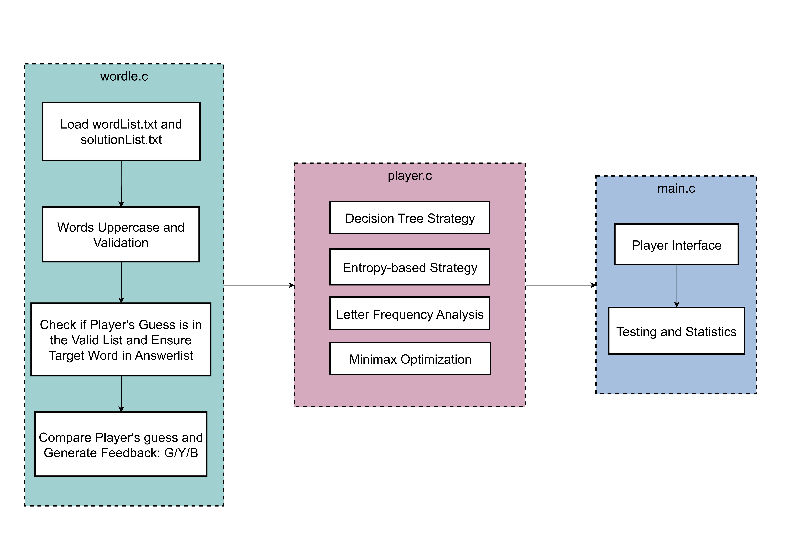
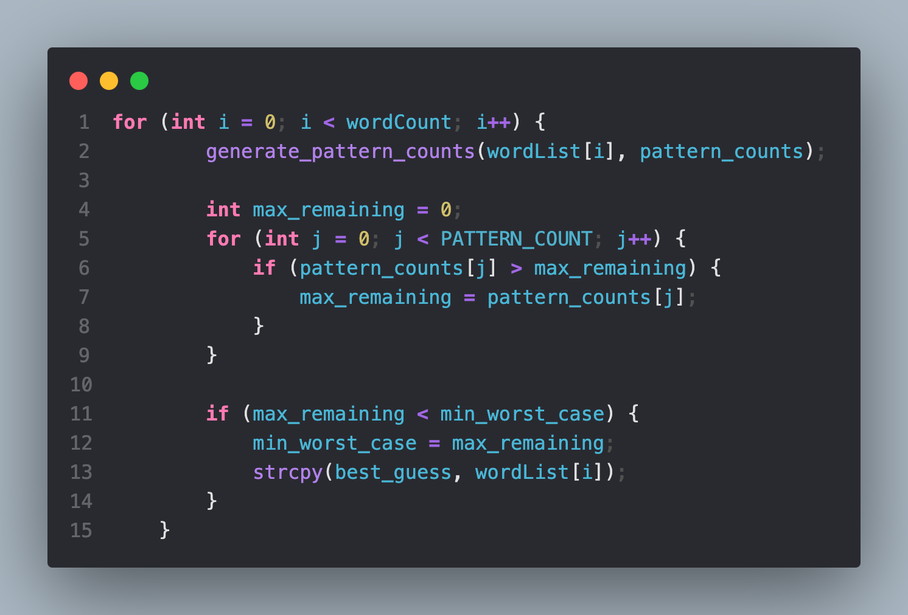
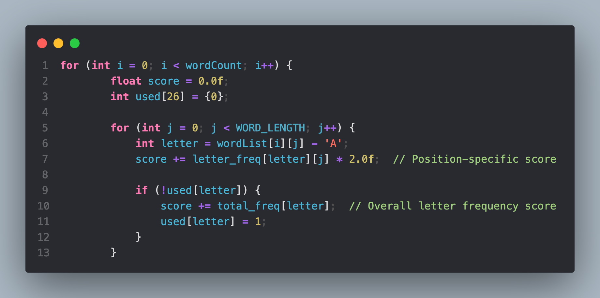
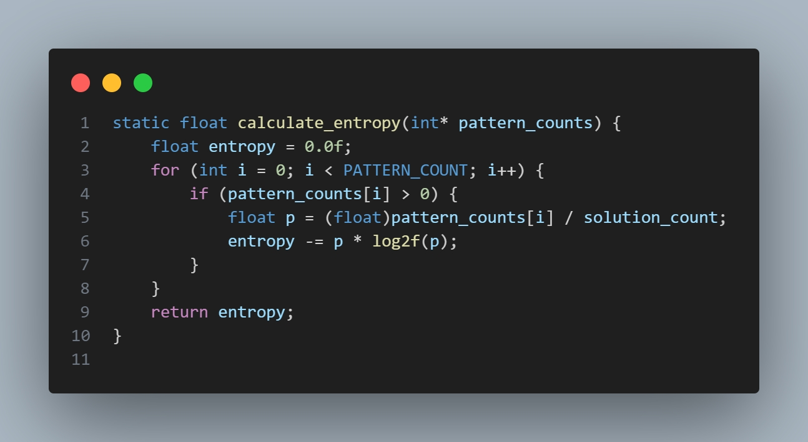
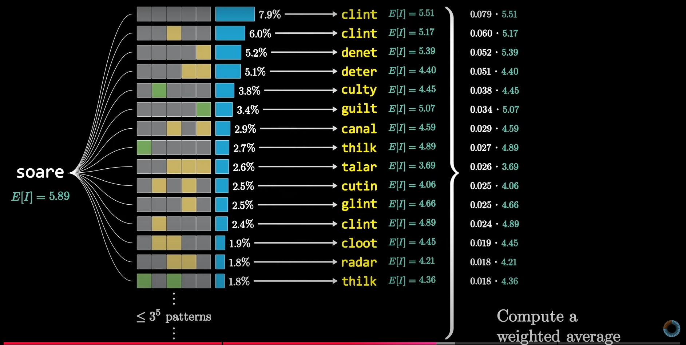
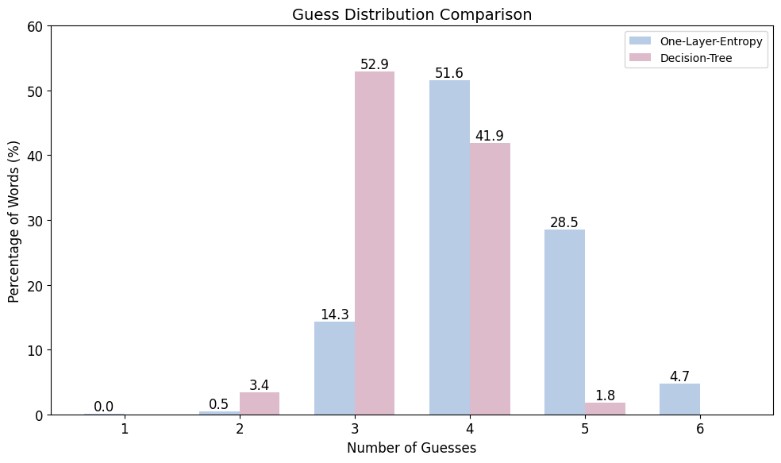
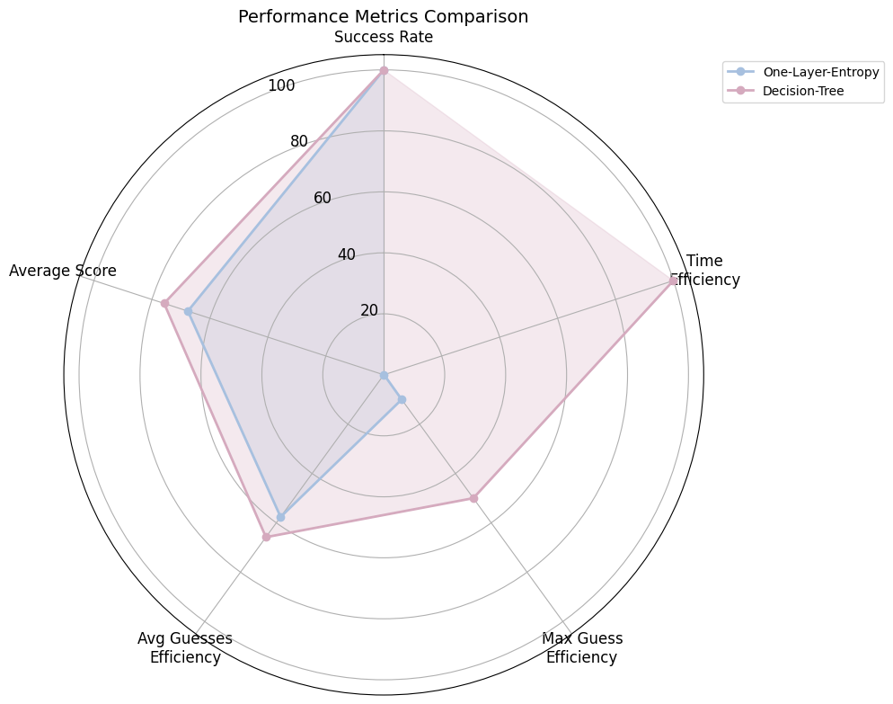

<div class="middle center">
<div style="width: 100%">

# Wordle with Solver

<hr/>

Group 1:Haotian Fang, Yu Ma, Yiyao Yin, Che Zhai, Yinuo Zhu

</div>
</div>

<!--s-->

<div class="middle center">
<div style="width: 100%">

# Part 1. Code Accessibility

</div>
</div>

<!--v-->

## Code Accessibility

- All code can be found on GitHub:  
  [@WncFht](https://github.com/WncFht/).
- Repository:  
  [Wordle-with-Solver](https://github.com/WncFht/Wordle-with-Solver).
- Released:  
  [Version 1.0.0](https://github.com/WncFht/Wordle-with-Solver/releases/tag/v1.0.0).

<!--s-->

<div class="middle center">
<div style="width: 100%">

# Part 2. Overview

</div>
</div>

<!--v-->

## Overview

<div class="three-line">



</div>

<!--s-->

<div class="middle center">
<div style="width: 100%">

# Part 3. Background

</div>
</div>

<!--v-->

## Strategies Overview

### Minimax Strategy
- Minimizes the maximum possible remaining solutions.
- Good for worst-case scenario optimization.

### Frequency-Based Strategy
- Uses letter frequency analysis.
- Considers both position-specific and overall frequencies.

### Entropy-Based Strategy
- Uses information theory to maximize information gain.
- Starts with "STARE" as the first guess.

<!--s-->

<div class="middle center">
<div style="width: 100%">

# Part 4. Minimax-Based Player

</div>
</div>

<!--v-->

## Minimax Strategy

### Equations

$$
N_i(w) = \sum_{s \in S} \delta(P(w, s), P_i)
$$

$$
M(w) = \max_{i} N_{i}(w)
$$


<!--v-->

## Core Code

<!-- <div class="three-line">



</div> -->

```C++
    for (int i = 0; i < wordCount; i++) {
        generate_pattern_counts(wordList[i], pattern_counts);
        
        int max_remaining = 0;
        for (int j = 0; j < PATTERN_COUNT; j++) {
            if (pattern_counts[j] > max_remaining) {
                max_remaining = pattern_counts[j];
            }
        }
        
        if (max_remaining < min_worst_case) {
            min_worst_case = max_remaining;
            strcpy(best_guess, wordList[i]);
        }
    }
```

<!--s-->

<div class="middle center">
<div style="width: 100%">

# Part 5. Frequency-Based Player

</div>
</div>

<!--v-->

## Frequency-Based Player

### Scoring Formula

$$
\text{score}(w) = \sum_{j=1}^{k} 2 \cdot \text{letter\_freq}[L_j][j] + \sum_{L \in w} \text{total\_freq}[L]
$$

### Optimal Guess

$$
w_{\text{best}} = \arg\min_{w} M(w)
$$

<!-- <div class="three-line">



</div> -->

<!--v-->

## Core Code

```C++
    for (int i = 0; i < wordCount; i++) {
        float score = 0.0f;
        int used[26] = {0};
        
        for (int j = 0; j < WORD_LENGTH; j++) {
            int letter = wordList[i][j] - 'A';
            score += letter_freq[letter][j] * 2.0f;  // Position-specific score
            
            if (!used[letter]) {
                score += total_freq[letter];  // Overall letter frequency score
                used[letter] = 1;
            }
        }
        
        if (score > best_score) {
            best_score = score;
            strcpy(best_guess, wordList[i]);
        }
    }
```
<!--s-->

<div class="middle center">
<div style="width: 100%">

# Part 6. Entropy-Based Player

</div>
</div>

<!--v-->

## Information Entropy

### Formula

$$
H(X) = -\sum_{i=1}^{n} p(x_i) \log_2 p(x_i)
$$

### Steps
1. Initialize solution set.
2. Update possible words.
3. Calculate entropy.
4. Pick word with highest entropy.

<!--v-->

## Core Code

<!-- <div class="three-line">



</div> -->

```C++
static float calculate_entropy(int* pattern_counts) {
    float entropy = 0.0f;
    for (int i = 0; i < PATTERN_COUNT; i++) {
        if (pattern_counts[i] > 0) {
            float p = (float)pattern_counts[i] / solution_count;
            entropy -= p * log2f(p);
        }
    }
    return entropy;
}
```

<!--v-->

## Weighted Entropy

### Insights
- **Optimal Guess:** Maximizes entropy and probability.
- **Global Optimality:** Local entropy maximization may not suffice; future entropy must be weighted.

<div class="three-line">



</div>

<!--s-->

<div class="middle center">
<div style="width: 100%">

# Part 7. Decision-Tree-Based Player

</div>
</div>

<!--v-->

## Decision Tree

```text
salet BBBBB1 courd BBBBB2 nymph BBBBY3 whiff GGGGG4
salet BBBBB1 courd BBBBB2 nymph BGYYB3 pygmy GGGGG4
salet BBBBB1 courd BBBBB2 nymph BYBBB3 fizzy GGGGG4
salet BBBBB1 courd BBBBB2 nymph BYBBB3 fizzy YGBBG4 jiffy GGGGG5
salet BBBBB1 courd BBBBB2 nymph BYBGY3 hippy GGGGG4
salet BBBBB1 courd BBBBB2 nymph BYBYB3 piggy GGGGG4
salet BBBBB1 courd BBBBB2 nymph BYGGB3 wimpy GGGGG4
salet BBBBB1 courd BBBBB2 nymph GGGGG3
salet BBBBB1 courd BBBBB2 nymph GYBBB3 ninny GGGGG4
salet BBBBB1 courd BBBBB2 nymph YBYBB3 minim GGGGG4
salet BBBBB1 courd BBBBB2 nymph YGBBB3 vying GGGGG4
salet BBBBB1 courd BBBBB2 nymph YYBBB3 kinky GGGGG4
salet BBBBB1 courd BBBBB2 nymph YYBBY3 whiny GGGGG4
salet BBBBB1 courd BBBBB2 nymph YYBYB3 pinky GGGGG4
salet BBBBB1 courd BBBBG2 vivid GGGGG3
```
<!--v-->

## Overview

1. **Initial Move:**
   - Always starts with `"SALET"`.
2. **Pattern Tracking:**
   - Maintains cumulative patterns (e.g., `SALET GYBBG1 CRANE GBBBY2`).
3. **Decision Making:**
   - Consults `tree.txt` for next optimal move.

<!--v-->

## Core Code

```C++
static const char* find_next_move(const char* feedback, int level) {
    char new_pattern[32];
    sprintf(new_pattern, "%s %s%d ", current_word, feedback, level);
    strcat(cumulative_pattern, new_pattern);
    // Search for matching line
    for (int i = 0; i < line_count; i++) {
        if (strstr(decision_lines[i], cumulative_pattern) == 
            decision_lines[i]) { // Extract next word
            const char* line = decision_lines[i] + strlen(cumulative_pattern);
            char next_word[WORD_LENGTH + 1];
            if (sscanf(line, "%5s", next_word) == 1) {
                printf("Found next word: %s in line: %s\n", next_word, decision_lines[i]);
                return strdup(next_word);
            }
        }
    }
    return NULL;
}
```

<!--s-->

<div class="middle center">
<div style="width: 100%">

# Part 8. Results

</div>
</div>

<!--v-->

## Guess Distribution

<div class="three-line">



</div>

<!--v-->

## Performance Metrics

<div class="three-line">



</div>

<!--s-->

<div class="middle center">
<div style="width: 100%">

# Part 9. References

</div>
</div>

<!--v-->

## References

1. [3b1b Solution](https://www.youtube.com/watch?v=v68zYyaEmEA)
2. [3b1b Mistake Clarification](https://www.youtube.com/watch?v=fRed0Xmc2Wg)
3. [Wordle Strategies](https://sonorouschocolate.com/notes/index.php?title=The_best_strategies_for_Wordle)

<!--s-->

<div class="middle center">
<div style="width: 100%">

# Part 10. Use of AI

</div>
</div>

<!--v-->

## AI Assistance

### Prompts:
1. **Prompt 1:** How to solve Wordle and give me some ideas.
2. **Prompt 2:** Please refactor my code and add some annotation.
